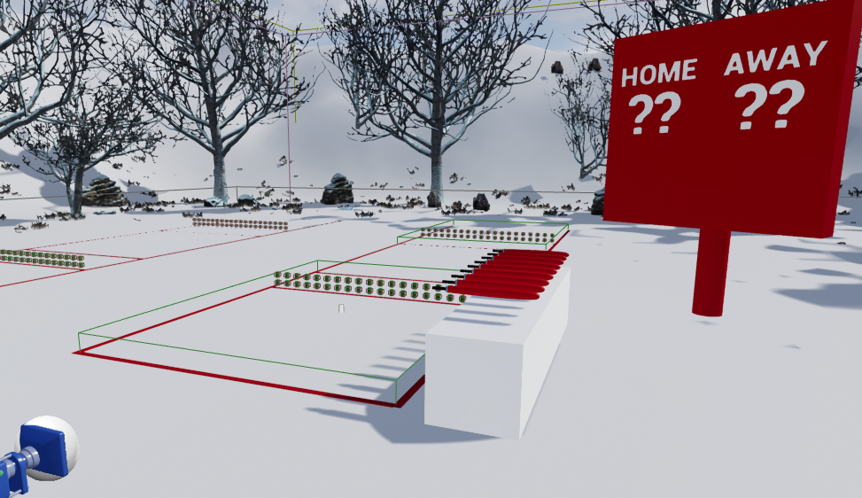

# KyykkaVR

- https://www.youtube.com/watch?v=9AhbZOc7iEg
WIP Prototype developed with Unreal Engine 4

- Karttu and kyykkä modeled by Marcus Kindstedt
- "Winter Forest Set"  by Patrick used to decorate a bit.
- Lot of good VR-info learned from "DownToCode" channel: https://www.youtube.com/channel/UC_F1wYEAqzdrE6vs6w9_vMQ
